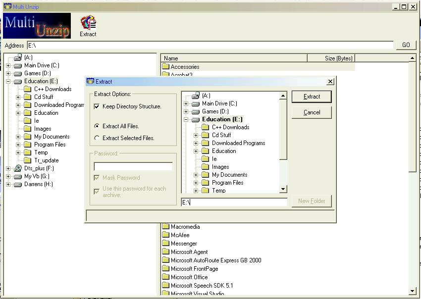



## MultiUnzip

### Description

MultiUnzip.

Used to extract files/folders from .zip files.

have you ever downloaded a program/game and it's compressed into hundreds of .zip files. this prog extracts them all for you at the click of a button.

See Screenshot.
 
### More Info
 

             |
---                |---
**Submitted On**   |2002-07-12 17:12:32
**By**             |[CoderFromHell](https://github.com/Planet-Source-Code/PSCIndex/blob/master/ByAuthor/coderfromhell.md)
**Level**          |Advanced
**User Rating**    |4.7 (14 globes from 3 users)
**Compatibility**  |VB 6\.0
**Category**       |[Files/ File Controls/ Input/ Output](https://github.com/Planet-Source-Code/PSCIndex/blob/master/ByCategory/files-file-controls-input-output__1-3.md)
**World**          |[Visual Basic](https://github.com/Planet-Source-Code/PSCIndex/blob/master/ByWorld/visual-basic.md)
**Archive File**   |[MultiUnzip1053787122002\.zip](https://github.com/Planet-Source-Code/coderfromhell-multiunzip__1-36838/archive/master.zip)

